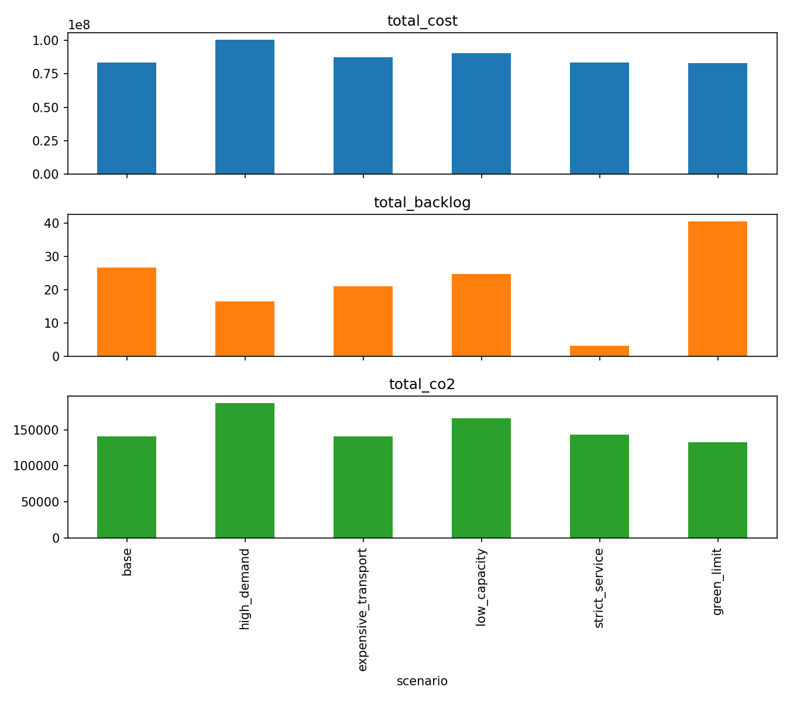
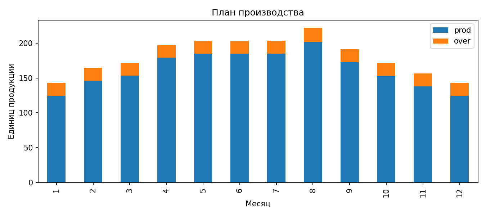
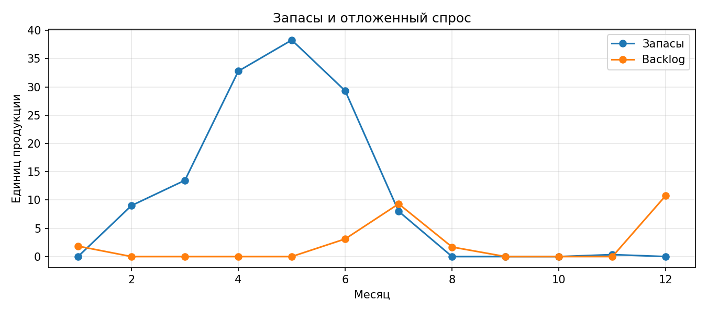
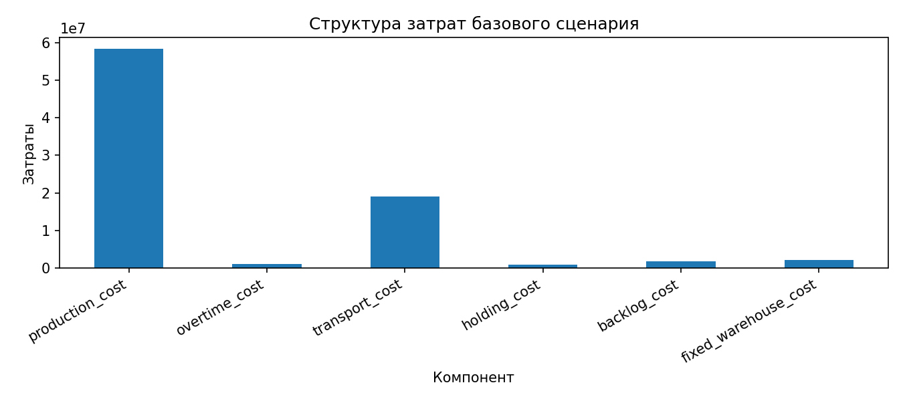
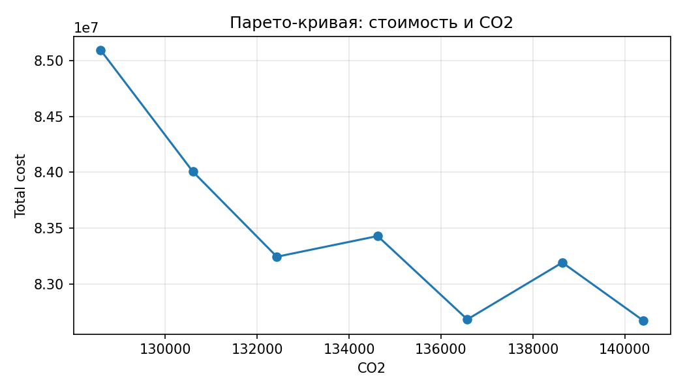
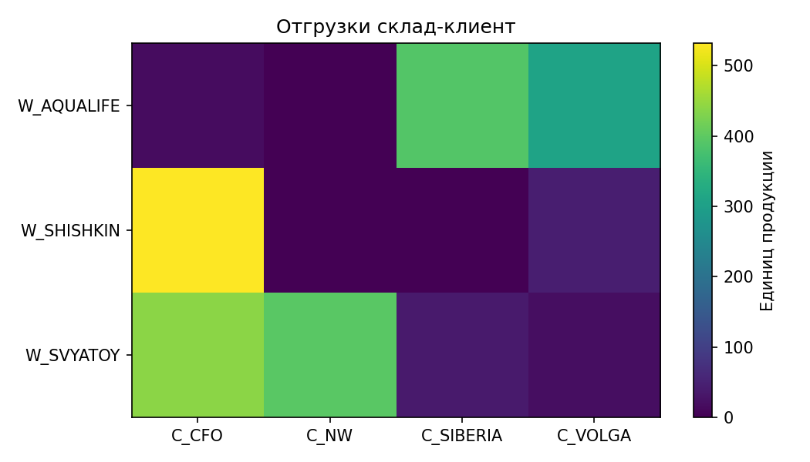

# Тактическая оптимизация цепочки поставок бутилированной воды


Мы сделали учебный проект по экономико-математическому моделированию: построили MILP-модель тактического планирования производства, хранения и распределения бутилированной воды. Модель помогает выбрать, сколько произвести, через какие склады везти продукцию, где держать запасы, какие маршруты использовать и как меняется план при росте спроса, дорогом транспорте, снижении мощностей и экологическом ограничении.

## Содержание
- [Идея проекта](#идея-проекта)
- [Что оптимизирует модель](#что-оптимизирует-модель)
- [Настройки модели](#настройки-модели)
- [Данные](#данные)
- [Сценарии](#сценарии)
- [Результаты и скриншоты](#результаты-и-скриншоты)
- [Как запустить](#как-запустить)
- [Структура репозитория](#структура-репозитория)
- [Ограничения и развитие](#ограничения-и-развитие)
- [Использование ИИ](#использование-ии)

## Идея проекта
Мы рассматриваем сеть поставок бутилированной воды:

- заводы производят продукцию в несколько периодов;
- склады принимают поставки, хранят запас и отгружают клиентам;
- клиенты имеют помесячный спрос;
- транспорт учитывается не только как объем перевозки, но и как целое число рейсов;
- часть спроса может быть временно отложена через backlog, но за это начисляется штраф;
- дополнительно контролируются сервисный уровень и суммарные выбросы CO2.

Главная цель проекта - не просто получить оптимальное число, а понять, какие ограничения реально управляют планом: мощности, склады, транспорт, сервис или экологический лимит.

## Что оптимизирует модель
Модель минимизирует суммарные затраты:

```text
production_cost
+ overtime_cost
+ transport_cost
+ holding_cost
+ backlog_cost
+ fixed_warehouse_cost
```

При этом модель выбирает:

| Решение | Что означает |
|---|---|
| `production[p,f]` | выпуск на заводе `f` в периоде `p` |
| `overtime[p,f]` | сверхурочный выпуск |
| `ship_fw[p,f,w]` | поставки с завода `f` на склад `w` |
| `ship_wc[p,w,c]` | поставки со склада `w` клиенту `c` |
| `inventory[p,w]` | запас на складе |
| `backlog[p,c]` | отложенный спрос клиента |
| `use_warehouse[w]` | используется ли склад |
| `trucks_fw`, `trucks_wc` | целое число рейсов на маршрутах |

## Настройки модели
Модель реализована в AMPL внутри ноутбука [`emm_project.ipynb`](emm_project.ipynb), данные загружаются из Excel-файлов, расчеты выполняются solver'ом HiGHS.

Ключевые параметры:

| Параметр | Значение / источник |
|---|---|
| Solver | HiGHS |
| Тип модели | MILP |
| Горизонт планирования | периоды из листа `periods` |
| Сервисный уровень | `service_level_min = 0.92` |
| Штраф за backlog | `backlog_penalty = 63000` |
| Big-M | `big_m = 100000` |
| Экологический лимит | задается сценарием через `co2_limit` |
| Транспорт | оплачивается по целым рейсам грузовиков |

Основные группы ограничений:

- баланс потока по складам и периодам;
- производственные мощности и сверхурочный выпуск;
- вместимость складов;
- связь потоков со включением склада;
- ограничение минимального уровня сервиса;
- целочисленные ограничения по числу рейсов;
- лимиты доступности маршрутов и числа грузовиков;
- суммарный лимит выбросов CO2.

## Данные
Основной файл данных - [`data/project_data.xlsx`](data/project_data.xlsx). Он содержит листы:

| Лист | Содержание |
|---|---|
| `periods` | периоды планирования |
| `plants` | заводы, мощности и производственные затраты |
| `warehouses` | склады, вместимость, хранение и фиксированные затраты |
| `customers` | клиенты |
| `demand` | спрос по периодам и клиентам |
| `routes_fw` | маршруты завод -> склад |
| `routes_wc` | маршруты склад -> клиент |
| `params` | глобальные параметры модели |
| `data_sources` | источники, исходные значения и формулы преобразования |

Отдельно лежат:

- [`data/scenarios.xlsx`](data/scenarios.xlsx) - сценарии для стресс-тестирования модели;
- [`data/demo_project_data.xlsx`](data/demo_project_data.xlsx) - демонстрационный файл для технической проверки;
- [`scripts/official_water_data.py`](../scripts/official_water_data.py) - скрипт подготовки данных из открытых источников.

## Сценарии
Сценарии позволяют проверить устойчивость решения:

| Сценарий | Что меняется |
|---|---|
| `base` | базовые значения |
| `high_demand` | спрос увеличен на 15% |
| `expensive_transport` | транспорт дороже на 20% |
| `low_capacity` | мощности снижены на 15% |
| `strict_service` | штраф за backlog увеличен в 2 раза |
| `green_limit` | добавлен жесткий лимит CO2 |

Сводные результаты после запуска сохраняются в [`results/all_scenarios_summary.csv`](results/all_scenarios_summary.csv).

## Результаты и скриншоты
Ниже можно вставить скриншоты из ноутбука или итоговой презентации. Мы оставили готовые места под ключевые экраны, чтобы README выглядел как страница проекта на GitHub.

### Основной вывод ноутбука
Сюда можно добавить скриншот после финального запуска ноутбука:

```markdown

```

### Сравнение сценариев


### Производственный план


### Запасы и backlog


### Структура затрат


### Экологический trade-off


### Тепловая карта поставок


После запуска ноутбука также формируются таблицы:

| Файл | Что содержит |
|---|---|
| [`results/base_solution_summary.csv`](results/base_solution_summary.csv) | итог базового решения |
| [`results/all_scenarios_summary.csv`](results/all_scenarios_summary.csv) | сравнение сценариев |
| [`results/active_constraints.csv`](results/active_constraints.csv) | активные ограничения |
| [`results/shadow_prices.csv`](results/shadow_prices.csv) | теневые цены для LP-диагностики |
| [`results/pareto_points.csv`](results/pareto_points.csv) | точки для анализа CO2 и затрат |
| [`results/production_plan.csv`](results/production_plan.csv) | план выпуска |
| [`results/shipments_fw.csv`](results/shipments_fw.csv) | поставки завод -> склад |
| [`results/shipments_wc.csv`](results/shipments_wc.csv) | поставки склад -> клиент |
| [`results/warehouse_inventory.csv`](results/warehouse_inventory.csv) | запасы по складам |

## Как запустить
Проект рассчитан на запуск в Google Colab.

1. Откройте [`emm_project.ipynb`](emm_project.ipynb).
2. Запустите ячейку установки зависимостей.
3. Проверьте, что рядом с ноутбуком есть папка `data/` с файлами `project_data.xlsx` и `scenarios.xlsx`.
4. Запустите все ячейки сверху вниз.
5. После расчета проверьте папки `results/` и `charts/`.

Локально проект можно запускать в Python-окружении с установленными `pandas`, `matplotlib`, `openpyxl`, `amplpy` и доступным solver'ом HiGHS.

## Структура репозитория
```text
emml_project/
├── emm_project.ipynb          # основной ноутбук
├── README.md                  # описание проекта для GitHub
├── data/                      # Excel-данные и сценарии
├── results/                   # CSV-результаты после запуска
├── charts/                    # графики для отчета и README
└── screenshots/               # сюда можно положить скриншоты из ноутбука

scripts/
├── official_water_data.py     # подготовка официально обоснованных данных
└── generate_official_project_data.py

build_project.py               # генератор ноутбука, README и шаблонов данных
```

## Ограничения и развитие
Что модель уже учитывает:

- несколько периодов;
- склады и запасы;
- отложенный спрос;
- целочисленные рейсы;
- использование складов через бинарную переменную;
- сервисный уровень;
- ограничение CO2;
- сценарный анализ.

Что можно развить дальше:

- добавить несколько видов продукции;
- перейти от помесячного к дневному планированию;
- учитывать точную маршрутизацию машин внутри города;
- добавить случайность спроса и имитационную проверку;
- учитывать персонал, смены и ограничения погрузки;
- сравнить MILP-решение с простыми эвристиками.

## Использование ИИ
ИИ использовался как технический помощник при работе с Python-кодом, оформлением ноутбука, поиском открытых источников, подготовкой данных и проверкой связности проекта. Математическую постановку, AMPL-модель, смысл ограничений, выбор сценариев и выводы по результатам мы делали самостоятельно.

Подробная декларация находится в разделе «Описание применения генеративной модели» в [`emm_project.ipynb`](emm_project.ipynb).
